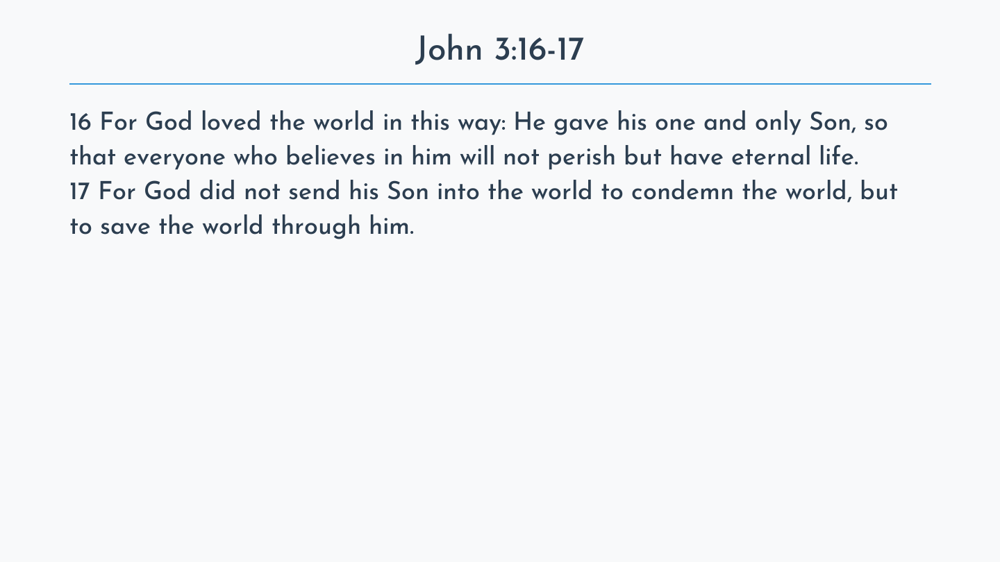

# Sermon Slides Generator

A macOS desktop app that turns a list of Bible references into presentation-ready PDF slides in seconds.

I built this for my church: every week, someone had to manually look up each passage the sermon referenced, copy the text, and paste it slide-by-slide into a deck. This app does that whole job — type the references, click generate, and get a polished PDF with a title slide (with an optional QR code or logo image of your choice) and one or more cleanly formatted slides per passage.



## How it works

1. Enter a sermon title and a list of passage references (e.g. `John 3:16-17`, `Psalm 23`), one per line
2. The app fetches each passage (CSB translation) from [BibleGateway](https://www.biblegateway.com/), strips footnotes while keeping verse numbers, and cleans up the text
3. Long passages are automatically split across multiple slides at sentence boundaries, sized to fit the slide layout
4. Each slide is rendered with Pillow (custom font, centered title, separator rule) and assembled into a single PDF with pypdf

## Tech stack

- **[PyWebView](https://pywebview.flowrl.com/)** — native desktop window with an HTML/CSS/JS frontend and a Python backend API
- **Pillow** — slide rendering (typography, layout, QR code compositing)
- **BeautifulSoup + Requests** — passage scraping with rate limiting between requests
- **pypdf** — merging per-slide PDFs into the final document
- **PyInstaller** — packaged as a standalone macOS `.app` bundle (see [BUILD.md](BUILD.md))

## Running from source

Requires Python 3.13+ and [uv](https://docs.astral.sh/uv/).

```bash
uv sync
uv run python main.py        # launch the GUI
```

There's also a headless CLI that reads references from a text file:

```bash
uv run python sermon_slides_generator.py Passages/short.txt
```

## Building the app

```bash
uv run python build.py
```

This produces `dist/Sermon Slides Generator.app` — a self-contained macOS app (~19 MB). Details and troubleshooting in [BUILD.md](BUILD.md).

## Development

```bash
uv run pytest        # run the test suite
uv run ruff check .  # lint
```

## Notes

- Passage text is fetched from BibleGateway with a delay between requests to be a polite scraper. The tool is intended for personal/church use; scripture quotations are from the Christian Standard Bible®, © 2017 Holman Bible Publishers.
- The bundled [Josefin Sans](https://fonts.google.com/specimen/Josefin+Sans) font is licensed under the [SIL Open Font License](OFL.txt).

## License

[MIT](LICENSE)
